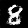
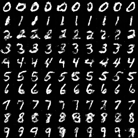

## DCGAN
生成给定的手写数字图像  
部分代码参考了：
[handspeaker](https://github.com/handspeaker/gan_practice) 和
[carpedm20](https://github.com/carpedm20/DCGAN-tensorflow)

## 使用
下载MNIST数据集：http://yann.lecun.com/exdb/mnist/ 到项目文件夹中   
我只用了训练集：train-images-idx3-ubyte, train-labels-idx1-ubyte
* 训练：
```
    python main.py --mode=train --epoch=2
```
* 生成：
```
    python main.py --mode=infer --num=which_num
```
* 或者一次生成所有数字的图像：
```
    python main.py --mode=infer --num=-1
```
 
 ## 生成的图像
 ```
     python main.py --mode=infer --num=5
 ```
 
 ```
     python main.py --mode=infer --num=8
 ```
 
 ```
     python main.py --mode=infer --num=-1
 ```
 
 
 
